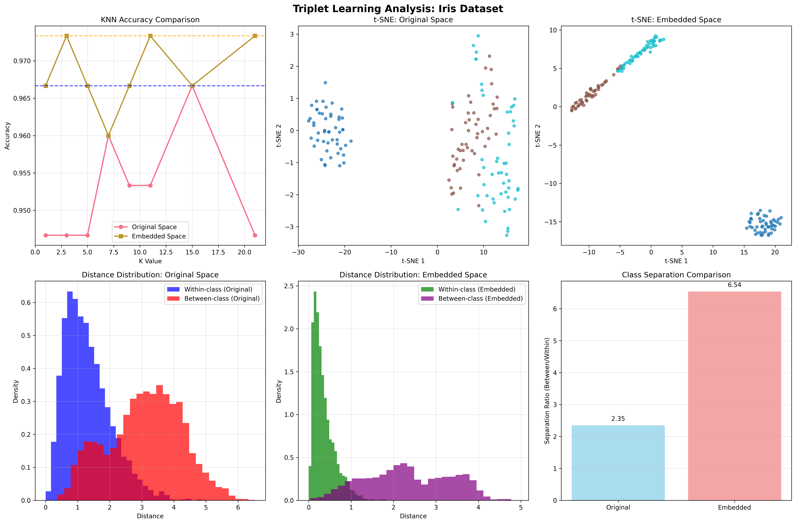
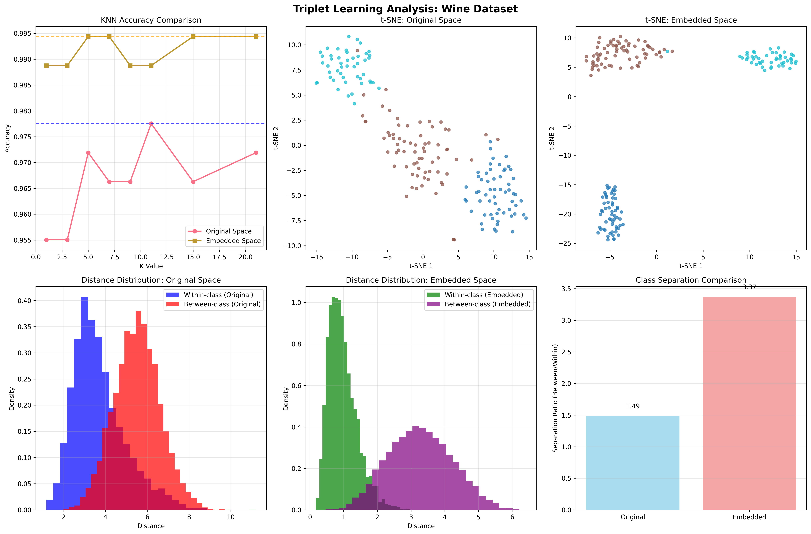
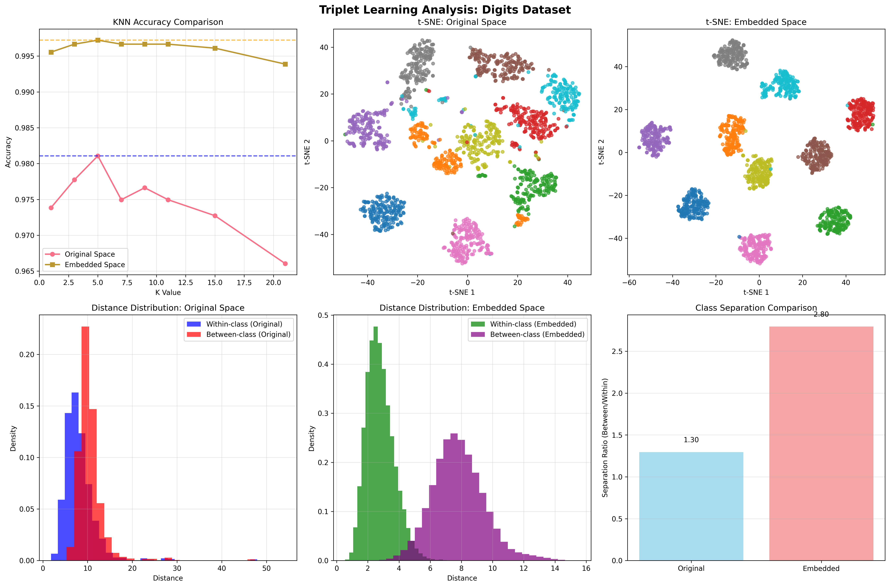
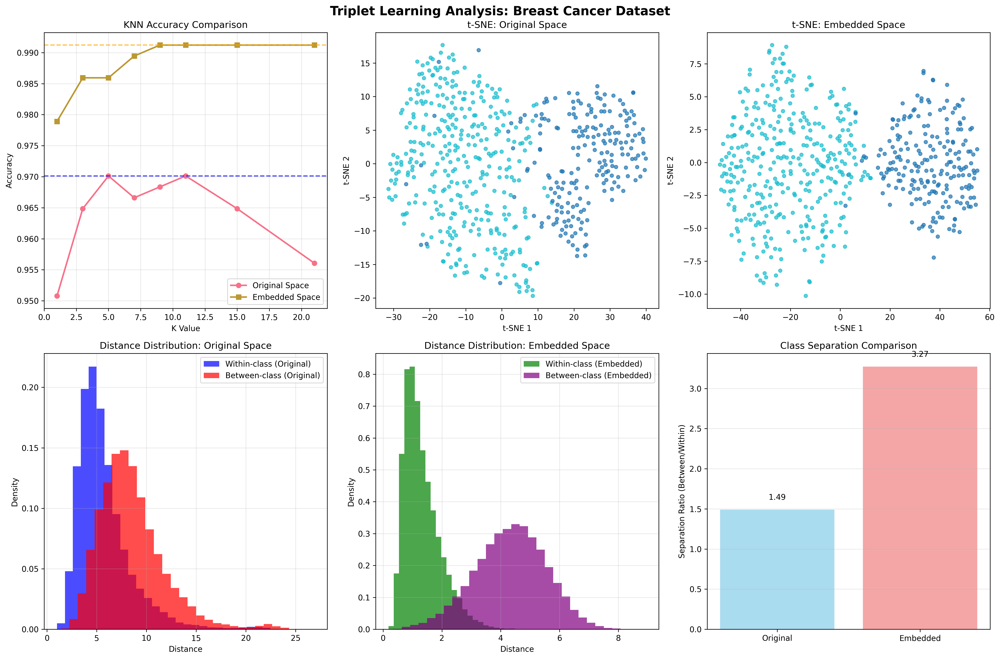

<p align="center">
    
</p>

# Topanda

Topanda is a lightweight toolkit for tabular data preprocessing, distance-based (metric-space) machine learning workflows, and nearest-neighbor algorithms. It provides:

- **Preprocessing Pipeline**: Numeric standardization and categorical entity embeddings
- **MetricSpace**: A unified interface for computing and querying distances in metric spaces
- **ML Algorithms**: KNN classification and radius-based neighbor search
- **Deep Metric Learning**: Triplet learning for optimized embedding spaces
- **Visualization**: 2D visualization utilities for neighbor relationships

---

## Features

- ✅ Numeric standardization (z-score normalization)
- ✅ Categorical entity embeddings via PyTorch
- ✅ Multiple distance metrics (Euclidean, Manhattan, Cosine, Minkowski, Mahalanobis)
- ✅ KNN Classifier with uniform and distance-weighted voting
- ✅ Radius-based neighbor search
- ✅ Optional distance caching for large datasets
- ✅ 2D visualization of neighbor relationships
- ✅ Deep metric learning approaches

---

## Quickstart

1. **Install dependencies:**

```bash
pip install -r requirements.txt
```

2. **Run tests:**

```bash
# KNN tests
python Tests/Test.py
```

---

## Load models from the main directory

If you are running from the repository root, import from the `Topanda` package directly:

```python
from Topanda import KNNClassifier, DataProcessor, TripletLearner

processor = DataProcessor(...)
model = KNNClassifier(...)
learner = TripletLearner(...)
```

This works when your current working directory is the project root and `Topanda/` is on the Python path.

---

## Triplet Learning Results

The test suite (`Tests/Test.py`) demonstrates the effectiveness of triplet learning for metric space optimization. Triplet learning improves KNN classification accuracy by learning embeddings where similar samples are closer together.
in this method we don't use predefined metrics , instead we build a suitable and customized metric for any labeled dataset . 

### Test Results Summary

| Dataset | Original KNN Accuracy | Embedded KNN Accuracy | Improvement |
|---------|----------------------|----------------------|-------------|
| Iris | 96.67% | 97.33% | +0.67% |
| Wine | 97.75% | 99.44% | +1.69% |
| Digits | 98.11% | 99.72% | +1.61% |
| Breast Cancer | 97.01% | 99.12% | +2.11% |

### Visualization Examples

#### Iris Dataset

*KNN accuracy comparison, t-SNE visualizations, and distance distributions for the Iris dataset.*

#### Wine Dataset

*KNN accuracy comparison, t-SNE visualizations, and distance distributions for the Wine dataset.*

#### Digits Dataset

*KNN accuracy comparison, t-SNE visualizations, and distance distributions for the Digits dataset.*

#### Breast Cancer Dataset

*KNN accuracy comparison, t-SNE visualizations, and distance distributions for the Breast Cancer dataset.*

Each plot shows:
- **KNN Accuracy Comparison**: Performance improvement after triplet learning
- **t-SNE Visualizations**: 2D projections of original vs embedded spaces
- **Distance Distributions**: Within-class vs between-class distances
- **Separation Ratio**: Quantitative measure of class separability

---

## Project Structure

```
Topanda/
├── core/                          # Core metric space utilities
│   ├── metric_space.py            # MetricSpace class (distances, queries)
│   ├── metrics.py                 # Metric factory and metric 
│   ├── cache.py                   # DistanceCache LRU cache
│   ├── validators.py              # Input validation utilities
│
│
├── PreProcessing/                 # Data preprocessing pipeline
│   ├── pipeline.py                # DataProcessor orchestrator
│   ├── numeric_processor.py       # Numeric standardization
│   ├── categorical_processor.py   # PyTorch entity embeddings
│   ├── validator.py               # Column validation
│
│
└── ML/                            # Machine learning algorithms
    ├── KNN.py                     # KNN Classifier
    ├── radius_neighbors.py        # Radius-based neighbor search + visualization
|
|
|
└── Deep metric learning
```

## Dependencies

```
numpy>=1.21
pandas>=1.3
scikit-learn>=0.24
torch>=1.9
scipy>=1.0
pytest
matplotlib
```

Install all:

```bash
pip install -r requirements.txt
```
## Notes & Troubleshooting

- **PyTorch**: Required only for `CategoricalProcessor` embeddings. If disabled, PyTorch is not needed.
- **MetricSpace validation**: Only numeric data is accepted. Use `DataProcessor` to clean/standardize data first.
- **KNN prediction**: Only supports single-point prediction (1D array). Pass one point at a time.
- **Visualization**: `radius_neighbors.visualize_neighbors()` requires exactly 2 features. Use preprocessing or feature selection to reduce dimensions.
- **Distance caching**: Enabled by default in `MetricSpace`. Useful for large datasets with many queries; disable with `cache_distances=False`.

---

## Contributing

Contributions welcome! Open issues or pull requests with:
- Clear problem/feature description
- Tests for new functionality
- Updates to this README if relevant

---

## License

MIT License — See LICENSE file for details


